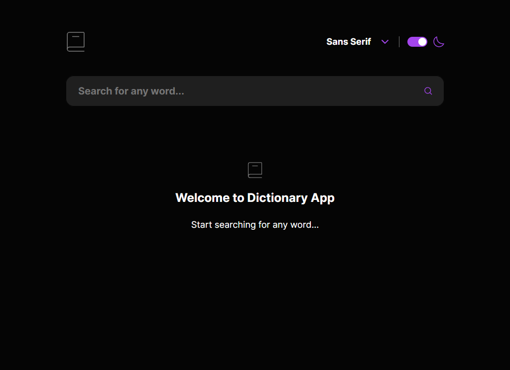
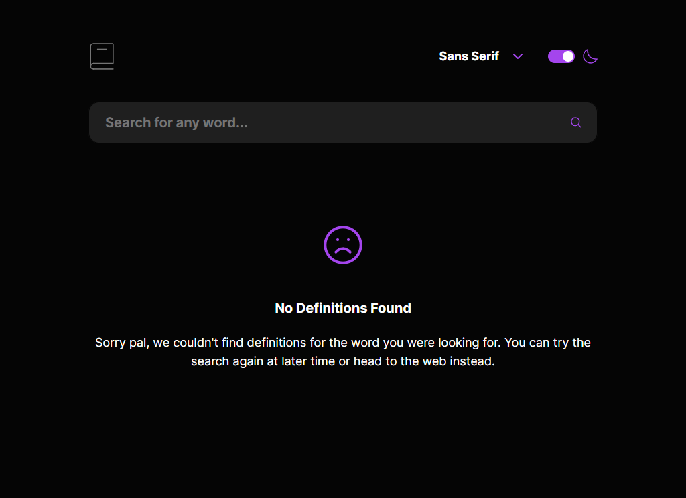
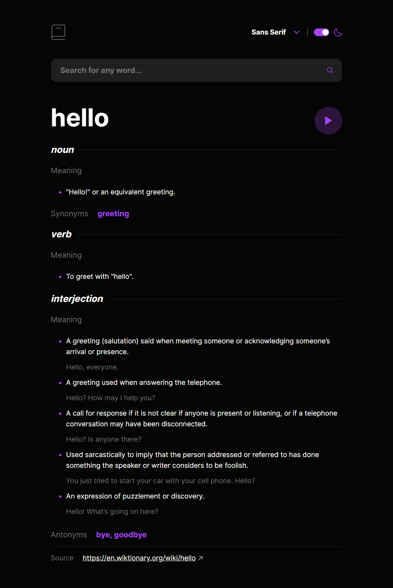
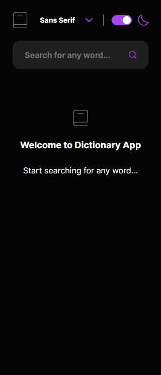
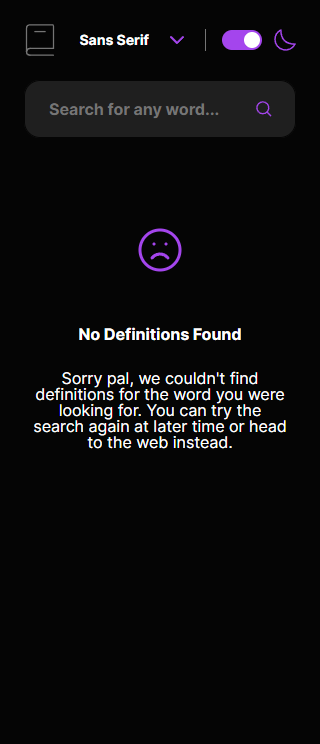
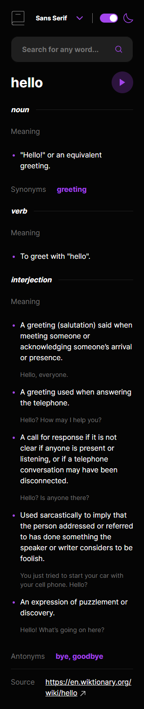

# Frontend Mentor - Dictionary Solution

This is a solution to the Multi-step form challenge on Frontend Mentor. Frontend Mentor challenges help you improve your coding skills by building realistic projects.

## Table of contents

- [Overview](#overview)
  - [The challenge](#the-challenge)
  - [Screenshot](#screenshot)
  - [Links](#links)
- [My process](#my-process)
  - [Built with](#built-with)
  - [What I learned](#what-i-learned)
- [Author](#author)

## Overview

### The challenge

Users should be able to:

- Search for words using the input field
- See the Free Dictionary API's response for the searched word
- See a form validation message when trying to submit a blank form
- Play the audio file for a word when it's available
- Switch between serif, sans serif, and monospace fonts
- Switch between light and dark themes
- View the optimal layout for the interface depending on their device's screen size
- See hover and focus states for all interactive elements on the page
- Bonus: Have the correct color scheme chosen for them based on their computer preferences. Hint: Research prefers-color-scheme in CSS.

### Screenshot

<p align="center" >
    
    
    
    
    
    
</p>

### Links

- [Live Site](https://dictionary-app-nu-nine.vercel.app/)

## My process

### Built with

- [React](https://reactjs.org/) - JS library
- [Tailwindcss](https://tailwindcss.com/) - For styles
- Typescript

### What I learned

#### Tailwindcss behavior with list and bullet customization

In tailwindcss, you can add the bullets to the bullet list using the class `"list-disc"` on the `ul` tag, but you can't control the color of the bullet through the list.

The `"list-disc"` will generate a `::marker` pseudo-element, which is something that can be accessed through tailwindcss to change the color of the bullet.
`className="list-disc marker:text-accent-1"`

#### Group Styling

You can style an element based on the parent style using the `group` keyword on the parent and add your style with `group-*` on the child.

```html
<button className="group bg-accent-2 hover:bg-accent-1">
  <svg className="fill-accent-1 group-hover:fill-white"></svg>
</button>
```

Read More: [tailwind docs](https://tailwindcss.com/docs/hover-focus-and-other-states#styling-based-on-parent-state)

## Author

- Frontend Mentor - [@yan-batista](https://www.frontendmentor.io/profile/yan-batista-1326)
- Github - [@yan-batista](https://github.com/yan-batista)
